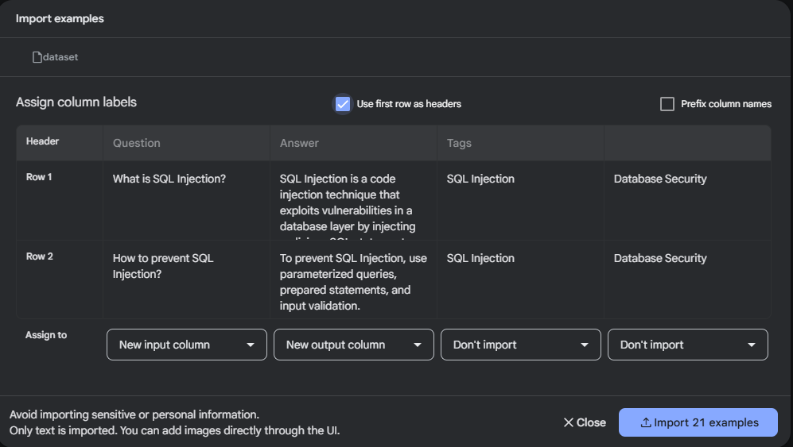
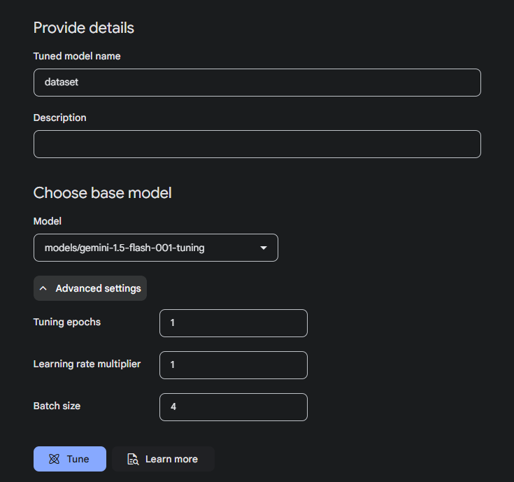
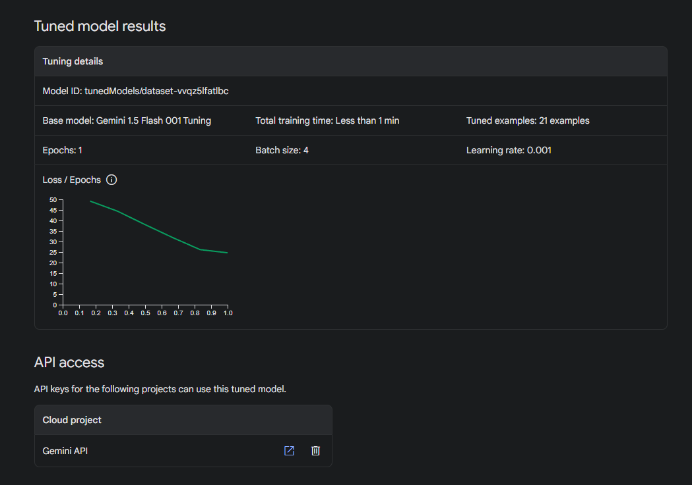

<h1 align='center'>
  Chatbot Widget
</h1>

<p align='center'>
This is a chatbot interface that provides useful responses based on user inputs
</p>

<div align='center'>
    
    
    
    
    
</div>
<br/>

# Setting up and running the application locally

## Requirements

- Docker

## Run application

1. Change directories into the project source root: cd Chatbot/
2. Run docker-compose up --build. This will perform the initial build and then launch your browser to your local site (the first time you do this, it may take a few minutes).

## Folder Structure

```
Chatbot/
├─ backend/
├─ frontend/
├─ RAG/ (dataset for Retrieval-Augmented Generation )
├─ .gitignore
├─ docker-compose.yml
├─ README.md
```

# Tech Stack

## Frontend

- React
- TypeScript
- HTML / CSS

## Backend

- Node.js / Express
- Gemini API
- Express Session
- Redis

## Retrieval-Augmented Generation

- OWASP Q&A Dataset

# My approach to solving the task

I have analyzed the objective of the assignment and the main points of the front-end and back-end requirements.

## Objective

To develop a responsive chatbot system with a React frontend, a Node.js/Express backend, and Redis-based session management, integrating Google Gemini API and optionally incorporating a Retrieval-Augmented Generation (RAG) system for domain-specific responses.

## Frontend

### Key Features:

1. Floating Chatbot Widget:

- A widget that appears at the bottom-right of the webpage.
- Smooth animations for opening and closing the widget using CSS transitions.

2. Chat Interface:

- A message display area showing conversation history.
- User input box and a "Send" button to allow input submission.
- Messages styled as bubbles for better readability.

3. Interactivity:

- Messages are appended dynamically in a conversational format.
- Fetch API used for asynchronous communication with the backend.

### Technologies Used

- React for building the user interface and handling user interactions.
- CSS for styling the chat widget and animating open/close actions.
- Fetch API to interact with backend endpoints.

## Backend

### Key Features:

1. API Routes:

- `/chat`: Accepts user input, interacts with Google Gemini API, and returns the bot's response.
- `/history`: Retrieves session-based conversation history.

2. Session Management:

- Redis is used to store session data, maintaining conversational context between requests.
- Sessions are securely managed using express-session and connect-redis.

3. Integration with Google Gemini API:

- User inputs are sent to the Gemini API to generate natural language responses.
- Prompts are designed to ensure meaningful and context-aware responses.

### Technologies Used

- Node.js/Express for creating the API endpoints.
- Redis for fast session storage.
- Google Gemini API for chatbot responses.

# RAG component

- Retrieval-Augmented Generation (RAG) to enhance the chatbot’s responses by retrieving relevant data from a sample OWASP Q&A database and incorporating that data into its answers.

- The chatbot will be able to provide more accurate and informative responses by leveraging the retrieved data.

## How to setup RAG with Gemini API

1. Generate an API key for the Google Gemini API.
2. Create a dataset in CSV format, sourced from OWASP Q&A, containing input (questions) and output (answers).
3. Import the dataset into the Gemini API for fine-tuning.
   
4. Begin the fine-tuning process using the dataset.
   
5. Once fine-tuning is complete, the chatbot will be able to retrieve relevant data using the model ID.
   
6. Implement the RAG component in the chatbot to retrieve relevant data from the dataset and incorporate it into the chatbot's responses.

```javascript
const model = genAI.getGenerativeModel({
  model: "tunedModels/[ModelId]",
  safe,
});
```
